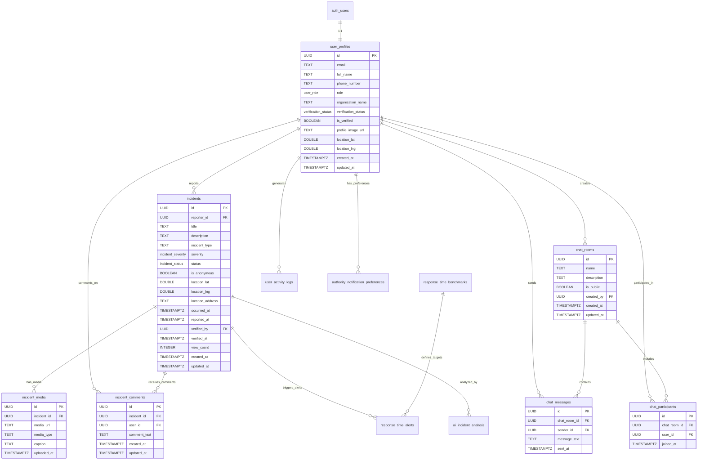
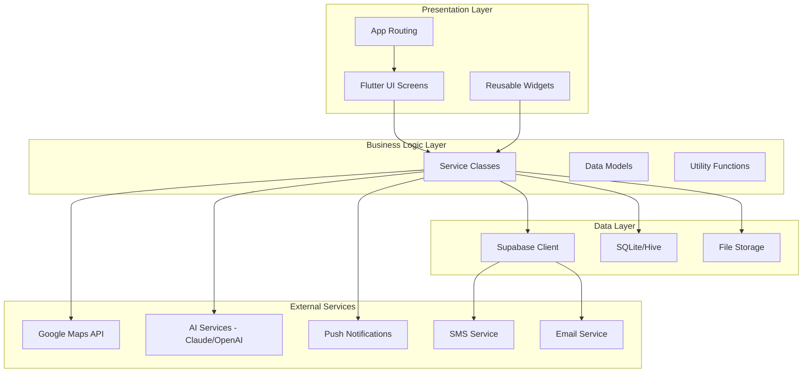
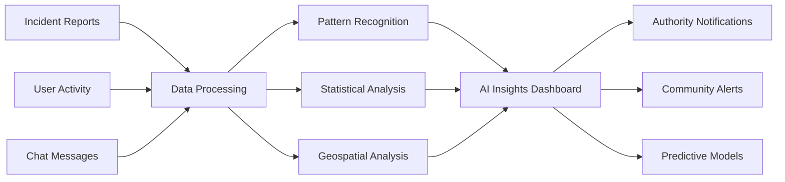
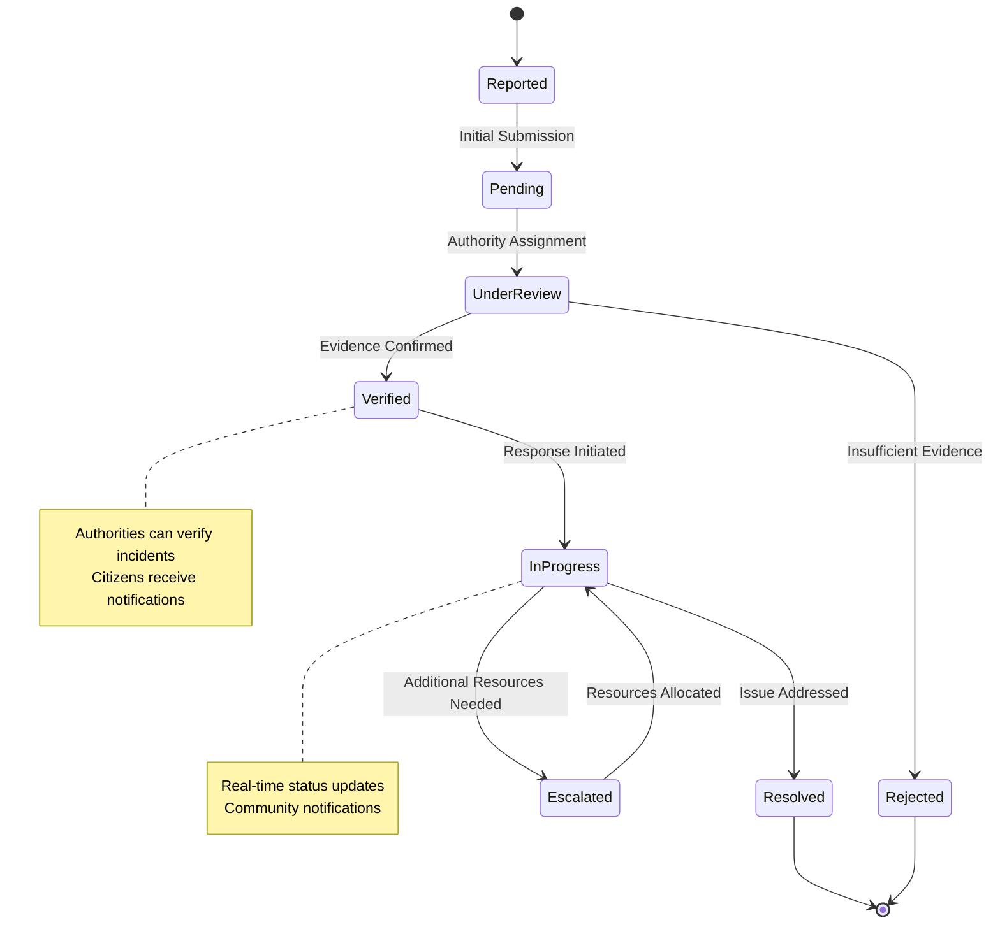
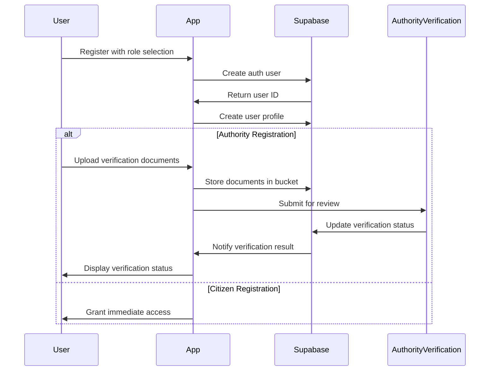
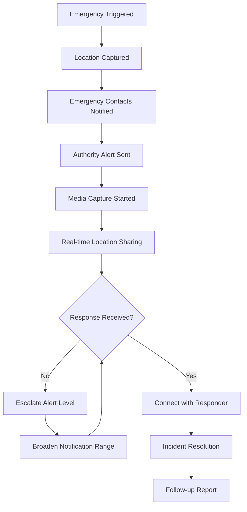

# BatFinder - Comprehensive Project Documentation

## 🦇 Project Overview

BatFinder is a comprehensive Flutter-based security platform designed for community safety and incident management. The platform enables real-time incident reporting, community communication, emergency response coordination, and advanced analytics for public safety authorities. Built with modern architecture patterns, Supabase backend integration, and AI-powered insights.

### Key Features
- **Real-time Incident Reporting** with geolocation and media attachments
- **Community Safety Chat** for neighborhood coordination
- **Emergency Panic Mode** for critical situations
- **Interactive Safety Maps** with incident visualization
- **AI-Powered Analytics** for pattern recognition and predictions
- **Role-Based Access Control** (Citizens, Authorities, NGOs)
- **Offline-First Architecture** with sync capabilities
- **Multi-Platform Support** (Android, iOS, Web)

---

## 📊 Database Architecture

### Entity Relationship Diagram



### Database Tables Overview

#### Core Tables
1. **user_profiles** - User information and role management
2. **incidents** - Security incident reports with geolocation
3. **incident_media** - Photos/videos attached to incidents
4. **incident_comments** - Community comments on incidents
5. **chat_rooms** - Community communication channels
6. **chat_participants** - Users participating in chat rooms
7. **chat_messages** - Real-time messaging system

#### Analytics & Monitoring Tables
8. **alert_statistics** - Daily aggregated metrics
9. **community_engagement_metrics** - Community participation analytics
10. **incident_hotspots** - AI-generated risk area predictions
11. **response_time_alerts** - Performance monitoring for authorities
12. **response_time_benchmarks** - Target response times by incident type
13. **ai_incident_analysis** - AI-powered pattern analysis results
14. **authority_notification_preferences** - Alert configuration for authorities
15. **user_activity_logs** - Audit trail and user behavior tracking

#### Custom Data Types
- `user_role`: 'ciudadano', 'autoridad', 'ONG'
- `incident_severity`: 'low', 'medium', 'high', 'critical'
- `incident_status`: 'pending', 'verified', 'in_progress', 'resolved', 'rejected'
- `verification_status`: 'pending', 'verified', 'rejected'
- `alert_status`: 'pending', 'notified', 'escalated', 'resolved', 'dismissed'
- `escalation_level`: 'warning', 'moderate', 'urgent', 'critical'
- `analysis_status`: 'pending', 'processing', 'completed', 'failed'

---

## 🏗️ Application Architecture

### Architecture Overview



### Project Structure

```
lib/
├── core/
│   ├── app_export.dart                 # Central imports and exports
│   └── utils/                          # Utility functions
├── main.dart                          # Application entry point
├── presentation/                      # UI Layer
│   ├── alert_dashboard/              # Main dashboard screen
│   ├── alert_details/                # Incident details view
│   ├── ai_insights_screen/           # AI analytics dashboard
│   ├── community_safety_chat/        # Community messaging
│   ├── create_edit_incident_screen/  # Incident creation/editing
│   ├── emergency_panic_mode/         # Emergency response UI
│   ├── enhanced_map_screen/          # Advanced mapping features
│   ├── incident_reporting/           # Report creation flow
│   ├── interactive_safety_map/       # Interactive incident map
│   ├── login_screen/                 # Authentication UI
│   ├── onboarding_flow/              # User onboarding
│   ├── profile_edit_screen/          # Profile management
│   ├── realtime_dashboard/           # Analytics dashboard
│   ├── splash_screen/                # App launch screen
│   ├── user_profile_settings/        # Settings management
│   └── user_registration/            # User registration flow
├── routes/
│   └── app_routes.dart               # Navigation routing
├── services/                         # Business Logic Layer
│   ├── advanced_analytics_service.dart
│   ├── ai_pattern_analysis_service.dart
│   ├── alert_service.dart
│   ├── anthropic_client.dart
│   ├── anthropic_service.dart
│   ├── chat_service.dart
│   ├── dashboard_service.dart
│   ├── incident_management_service.dart
│   ├── map_service.dart
│   ├── notification_service.dart
│   ├── offline_queue_service.dart
│   ├── profile_service.dart
│   ├── realtime_dashboard_service.dart
│   ├── response_time_monitoring_service.dart
│   └── supabase_service.dart
├── theme/
│   └── app_theme.dart                # Application theming
└── widgets/                          # Reusable UI Components
    ├── custom_app_bar.dart
    ├── custom_bottom_bar.dart
    ├── custom_error_widget.dart
    ├── custom_icon_widget.dart
    └── custom_image_widget.dart
```

### Key Architecture Patterns

1. **Service Layer Pattern**: Business logic encapsulated in service classes
2. **Repository Pattern**: Data access abstraction through Supabase service
3. **Observer Pattern**: Real-time updates via Supabase subscriptions  
4. **Factory Pattern**: Widget creation for dynamic UI components
5. **Singleton Pattern**: Global app state and service management
6. **Command Pattern**: Offline queue and action management

---

## 🔧 Technical Implementation

### Flutter Framework Configuration

#### Dependencies (pubspec.yaml)
```yaml
dependencies:
  flutter:
    sdk: flutter
  
  # Core Backend & Authentication
  supabase_flutter: ^2.9.1
  
  # UI & Responsive Design
  sizer: ^2.0.15
  flutter_svg: ^2.0.9
  google_fonts: ^6.1.0
  
  # Networking & Data
  dio: ^5.8.0
  cached_network_image: ^3.4.1
  connectivity_plus: ^7.0.0
  
  # Location & Maps
  google_maps_flutter: ^2.5.3
  geolocator: ^13.0.4
  
  # Media & Hardware
  camera: ^0.10.5+5
  image_picker: ^1.2.1
  speech_to_text: ^7.3.0
  record: ^6.0.0
  
  # Local Storage & Offline
  shared_preferences: ^2.2.2
  sqflite: ^2.4.2
  path_provider: ^2.1.5
  
  # UI Enhancement
  fluttertoast: ^8.2.4
  fl_chart: ^0.65.0
  local_auth: ^3.0.0
  flutter_slidable: ^4.0.3
  smooth_page_indicator: ^2.0.1
  lottie: ^3.3.2
  
  # Utilities
  share_plus: ^12.0.1
  intl: ^0.19.0
  dropdown_search: ^6.0.2
  uuid: ^4.5.2
  universal_html: ^2.2.4
```

### Service Architecture

#### SupabaseService - Core Database Integration
```dart
class SupabaseService {
  static SupabaseClient? _client;
  
  // Authentication Methods
  static Future<AuthResponse> signInWithEmail({required String email, required String password})
  static Future<AuthResponse> signUpWithEmail({required String email, required String password, required Map<String, dynamic> metadata})
  static Future<void> signOut()
  
  // User Profile Methods  
  static Future<Map<String, dynamic>?> getUserProfile(String userId)
  static Future<void> updateUserProfile({required String userId, required Map<String, dynamic> updates})
  
  // Incident Management
  static Future<List<Map<String, dynamic>>> getIncidents({String? status, String? severity, int limit = 50})
  static Future<String> createIncident({required String title, required String description, ...})
  static Future<void> updateIncidentStatus({required String incidentId, required String status})
  
  // Real-time Subscriptions
  static RealtimeChannel subscribeToIncidents(Function(Map<String, dynamic>) onIncident)
  static RealtimeChannel subscribeToChatMessages(String roomId, Function(Map<String, dynamic>) onMessage)
  
  // Analytics & Statistics
  static Future<Map<String, dynamic>> getDashboardStatistics()
}
```

#### Offline Queue Service - Network Resilience
```dart
class OfflineQueueService {
  // Queue Management
  static Future<void> addToQueue(QueueItem item)
  static Future<List<QueueItem>> getQueuedItems()
  static Future<void> processQueue()
  
  // Network Monitoring
  static Stream<ConnectivityResult> get connectivityStream
  static Future<bool> get isConnected
  
  // Sync Operations
  static Future<void> syncPendingIncidents()
  static Future<void> retryFailedOperations()
}
```

### Security Implementation

#### Row Level Security (RLS) Policies
```sql
-- User Profile Access Control
CREATE POLICY "users_view_all_profiles" ON user_profiles FOR SELECT TO authenticated USING (true);
CREATE POLICY "users_update_own_profile" ON user_profiles FOR UPDATE TO authenticated USING (id = auth.uid());

-- Incident Management Policies  
CREATE POLICY "users_view_all_incidents" ON incidents FOR SELECT TO authenticated USING (true);
CREATE POLICY "users_create_own_incidents" ON incidents FOR INSERT TO authenticated WITH CHECK (reporter_id = auth.uid());
CREATE POLICY "authority_verify_incidents" ON incidents FOR UPDATE TO authenticated USING (public.is_authority());

-- Chat Security Policies
CREATE POLICY "participants_view_chat_messages" ON chat_messages FOR SELECT TO authenticated 
USING (EXISTS (SELECT 1 FROM chat_participants cp WHERE cp.chat_room_id = chat_messages.chat_room_id AND cp.user_id = auth.uid()));
```

#### Authentication Flow
1. **Email/Password Authentication** via Supabase Auth
2. **Biometric Authentication** (fingerprint/face ID) for mobile
3. **Social Login Integration** (Google OAuth)
4. **Role-based Access Control** (Citizens, Authorities, NGOs)
5. **JWT Token Management** with automatic refresh

---

## 📱 User Interface & User Experience

### Screen Workflow Diagram

```mermaid
flowchart TD
    A[Splash Screen] --> B{User Authenticated?}
    B -->|No| C[Onboarding Flow]
    B -->|Yes| D[Alert Dashboard]
    
    C --> E[Login Screen]
    C --> F[Registration Screen]
    E --> D
    F --> G[Profile Setup]
    G --> D
    
    D --> H[Incident Reporting]
    D --> I[Safety Map]
    D --> J[Community Chat]
    D --> K[Profile Settings]
    D --> L[Emergency Mode]
    
    H --> M[Create Incident]
    M --> N[Media Attachment]
    N --> O[Location Selection]
    O --> P[Submit Report]
    
    I --> Q[Filter Incidents]
    I --> R[View Incident Details]
    R --> S[Add Comments]
    R --> T[Verify Incident (Authorities)]
    
    J --> U[Join Chat Rooms]
    J --> V[Send Messages]
    
    K --> W[Edit Profile]
    K --> X[Notification Settings]
    K --> Y[Privacy Settings]
    
    L --> Z[Emergency Contacts]
    L --> AA[Auto Location Share]
    L --> BB[Media Capture]
```

### Key UI Components

#### Alert Dashboard Screen
- **Statistics Cards**: Total alerts, active incidents, safety score
- **Quick Actions**: Report incident, emergency mode, view map
- **Recent Activity**: Latest incident updates and community messages
- **Safety Score Indicator**: Visual representation of area safety

#### Interactive Safety Map
- **Incident Markers**: Color-coded by severity (green/yellow/orange/red)
- **Clustering**: Grouped incidents in dense areas
- **Filter Controls**: Filter by incident type, severity, date range
- **Heat Map Layer**: Incident density visualization
- **Route Safety**: Safe path suggestions

#### Incident Reporting Flow
- **Incident Type Selection**: Dropdown with common incident categories
- **Severity Assessment**: Slider for impact rating
- **Location Capture**: Automatic GPS + manual adjustment
- **Media Attachment**: Camera/gallery integration for evidence
- **Anonymous Reporting**: Privacy toggle option
- **Contact Information**: Emergency contact integration

#### Community Safety Chat
- **Room Discovery**: Public safety discussion channels
- **Real-time Messaging**: WebSocket-powered instant messaging
- **User Verification**: Visual indicators for verified authorities
- **Message Threading**: Organized discussion topics
- **Media Sharing**: Photo/video evidence sharing

### Responsive Design Principles

#### Sizer Package Implementation
```dart
// Responsive sizing using Sizer package
Container(
  width: 90.w,           // 90% of screen width
  height: 25.h,          // 25% of screen height
  padding: EdgeInsets.all(4.w),
  child: Text(
    'Responsive Text',
    style: TextStyle(fontSize: 16.sp), // 16sp responsive font
  ),
)
```

#### Multi-Platform Considerations
- **Mobile-First Design**: Optimized for touch interfaces
- **Web Responsive Layout**: Adaptive grid systems for desktop
- **Platform-Specific Features**: Native integrations (camera, GPS, notifications)
- **Accessibility Support**: Screen reader compatibility, high contrast mode

---

## 🤖 AI Integration & Analytics

### AI-Powered Features

#### Pattern Analysis Service
```dart
class AIPatternAnalysisService {
  // Incident Pattern Recognition
  static Future<IncidentPatterns> analyzeIncidentPatterns(List<Incident> incidents)
  
  // Hotspot Prediction
  static Future<List<PredictedHotspot>> predictSafetyHotspots(AnalysisConfig config)
  
  // Risk Assessment
  static Future<RiskAssessment> assessAreaRisk(double lat, double lng, double radiusKm)
  
  // Recommendation Engine
  static Future<SafetyRecommendations> generateSafetyRecommendations(UserContext context)
}
```

#### Claude/Anthropic Integration
- **Incident Categorization**: Automatic classification of reports
- **Sentiment Analysis**: Community mood assessment from chat messages
- **Priority Scoring**: Intelligent incident priority assignment
- **Response Suggestions**: AI-generated response recommendations for authorities

#### Analytics Dashboard Features
- **Predictive Hotspot Mapping**: AI-identified high-risk areas
- **Incident Trend Analysis**: Pattern recognition over time
- **Community Engagement Metrics**: Participation and response analytics
- **Response Time Optimization**: Performance improvement suggestions

### Data Analytics Implementation

#### Real-time Analytics Pipeline


#### Key Metrics Tracked
1. **Incident Metrics**: Report frequency, resolution time, severity distribution
2. **Community Engagement**: Active users, message frequency, participation rates  
3. **Response Performance**: Authority response times, escalation patterns
4. **Safety Scores**: Area-based safety calculations, trend analysis
5. **User Behavior**: App usage patterns, feature adoption, retention rates

---

## 🔄 Workflow Documentation

### Incident Management Workflow



### User Registration & Verification Workflow



### Emergency Response Workflow



---

## 📚 API Documentation

### Supabase Database Functions

#### Core Database Functions
```sql
-- Check if user has authority role
CREATE FUNCTION public.is_authority() RETURNS boolean

-- Calculate incident hotspot prediction scores
CREATE FUNCTION calculate_hotspot_prediction_score(
    incident_count integer,
    severity_score numeric,
    time_period text
) RETURNS numeric

-- Get recent incidents for AI analysis
CREATE FUNCTION get_recent_incidents_for_analysis(
    days_back integer DEFAULT 30,
    limit_count integer DEFAULT 100
) RETURNS TABLE(...)

-- Generate response time recommendations
CREATE FUNCTION generate_response_recommendations(
    incident_type text,
    severity text,
    location_lat double precision,
    location_lng double precision
) RETURNS text
```

#### Edge Functions (Serverless)

##### SMS Notification Service
```typescript
// supabase/functions/send-sms/index.ts
export default async function sendSMS(req: Request): Promise<Response> {
  const { to, message, priority } = await req.json();
  
  // Validate authority permissions
  const user = await getUser(req);
  if (!user || !isAuthority(user)) {
    return new Response('Unauthorized', { status: 401 });
  }
  
  // Send SMS via provider API
  const result = await smsProvider.send({ to, message, priority });
  
  return new Response(JSON.stringify(result), {
    headers: { 'Content-Type': 'application/json' }
  });
}
```

##### Email Notification Service
```typescript
// supabase/functions/send-email/index.ts
export default async function sendEmail(req: Request): Promise<Response> {
  const { recipients, subject, htmlBody, attachments } = await req.json();
  
  // Authority verification and rate limiting
  const user = await getUser(req);
  await checkRateLimit(user.id, 'email');
  
  // Send email with incident details
  const result = await emailProvider.send({
    to: recipients,
    subject,
    html: htmlBody,
    attachments
  });
  
  return new Response(JSON.stringify(result));
}
```

### REST API Endpoints

#### Authentication Endpoints
```http
POST /auth/v1/signup
POST /auth/v1/token?grant_type=password  
POST /auth/v1/logout
GET  /auth/v1/user
PUT  /auth/v1/user
```

#### Incident Management Endpoints  
```http
GET    /rest/v1/incidents?select=*,reporter:user_profiles(*),incident_media(*)
POST   /rest/v1/incidents
PATCH  /rest/v1/incidents?id=eq.{incident_id}
DELETE /rest/v1/incidents?id=eq.{incident_id}

GET    /rest/v1/incident_comments?incident_id=eq.{incident_id}
POST   /rest/v1/incident_comments
```

#### Real-time Subscriptions
```javascript
// Subscribe to new incidents
const incidentsSubscription = supabase
  .channel('incidents')
  .on('postgres_changes', {
    event: 'INSERT',
    schema: 'public', 
    table: 'incidents'
  }, (payload) => {
    handleNewIncident(payload.new);
  })
  .subscribe();

// Subscribe to chat messages
const chatSubscription = supabase
  .channel(`chat_${roomId}`)
  .on('postgres_changes', {
    event: 'INSERT',
    schema: 'public',
    table: 'chat_messages',
    filter: `chat_room_id=eq.${roomId}`
  }, (payload) => {
    handleNewMessage(payload.new);
  })
  .subscribe();
```

---

## 🚀 Deployment & DevOps

### Environment Configuration

#### Environment Variables (env.json)
```json
{
  "SUPABASE_URL": "https://your-project.supabase.co",
  "SUPABASE_ANON_KEY": "your-anon-key",
  "ANTHROPIC_API_KEY": "your-anthropic-key", 
  "GOOGLE_WEB_CLIENT_ID": "your-google-client-id",
  "GOOGLE_MAPS_API_KEY": "your-maps-api-key"
}
```

#### Flutter Build Configuration
```bash
# Development build with environment
flutter run --dart-define-from-file=env.json

# Production Android build
flutter build apk --release --dart-define-from-file=env.json

# Production iOS build
flutter build ios --release --dart-define-from-file=env.json

# Web build for deployment
flutter build web --dart-define-from-file=env.json
```

### Supabase Deployment

#### Migration Management
```bash
# Apply new migrations
supabase db push

# Generate migration from schema changes  
supabase db diff -f new_migration_name

# Reset database to latest migration
supabase db reset

# Deploy edge functions
supabase functions deploy send-sms
supabase functions deploy send-email
```

#### Production Checklist
- [ ] Environment variables configured
- [ ] RLS policies tested and verified  
- [ ] Edge functions deployed and tested
- [ ] Storage buckets created with proper permissions
- [ ] Database indexes optimized
- [ ] Backup strategy implemented
- [ ] Monitoring and alerting configured

### Platform-Specific Deployment

#### Android Configuration
```gradle
// android/app/build.gradle
android {
    defaultConfig {
        applicationId "com.batfinder.app"
        minSdkVersion 21
        targetSdkVersion 34
        versionCode 1
        versionName "1.0.0"
    }
    
    signingConfigs {
        release {
            keyAlias keystoreProperties['keyAlias']
            keyPassword keystoreProperties['keyPassword']
            storeFile keystoreProperties['storeFile'] ? file(keystoreProperties['storeFile']) : null
            storePassword keystoreProperties['storePassword']
        }
    }
}
```

#### iOS Configuration  
```xml
<!-- ios/Runner/Info.plist -->
<key>NSLocationWhenInUseUsageDescription</key>
<string>BatFinder needs location access to report and display nearby security incidents.</string>

<key>NSCameraUsageDescription</key>
<string>BatFinder uses camera to capture evidence for incident reports.</string>

<key>NSMicrophoneUsageDescription</key>  
<string>BatFinder uses microphone to record audio evidence during incidents.</string>
```

---

## 🧪 Testing Strategy

### Unit Testing
```dart
// test/services/supabase_service_test.dart
import 'package:flutter_test/flutter_test.dart';
import 'package:batfinder/services/supabase_service.dart';

void main() {
  group('SupabaseService', () {
    test('should create incident with valid data', () async {
      // Arrange
      final incidentData = {
        'title': 'Test Incident',
        'description': 'Test Description',
        'severity': 'medium',
        // ... other required fields
      };
      
      // Act
      final incidentId = await SupabaseService.createIncident(incidentData);
      
      // Assert
      expect(incidentId, isNotNull);
      expect(incidentId, isA<String>());
    });
  });
}
```

### Widget Testing
```dart
// test/widgets/alert_card_widget_test.dart
import 'package:flutter/material.dart';
import 'package:flutter_test/flutter_test.dart';
import 'package:batfinder/presentation/alert_dashboard/widgets/alert_card_widget.dart';

void main() {
  testWidgets('AlertCardWidget displays incident information', (WidgetTester tester) async {
    // Arrange
    final incident = MockIncident();
    
    // Act
    await tester.pumpWidget(
      MaterialApp(
        home: AlertCardWidget(incident: incident),
      ),
    );
    
    // Assert
    expect(find.text(incident.title), findsOneWidget);
    expect(find.text(incident.description), findsOneWidget);
  });
}
```

### Integration Testing
```dart
// integration_test/app_test.dart
import 'package:flutter/material.dart';
import 'package:flutter_test/flutter_test.dart';
import 'package:integration_test/integration_test.dart';
import 'package:batfinder/main.dart' as app;

void main() {
  IntegrationTestWidgetsFlutterBinding.ensureInitialized();
  
  group('BatFinder Integration Tests', () {
    testWidgets('complete incident reporting flow', (WidgetTester tester) async {
      app.main();
      await tester.pumpAndSettle();
      
      // Navigate to incident reporting
      await tester.tap(find.byKey(Key('report_incident_button')));
      await tester.pumpAndSettle();
      
      // Fill incident form
      await tester.enterText(find.byKey(Key('incident_title')), 'Test Incident');
      await tester.enterText(find.byKey(Key('incident_description')), 'Test Description');
      
      // Submit incident
      await tester.tap(find.byKey(Key('submit_incident_button')));
      await tester.pumpAndSettle();
      
      // Verify success message
      expect(find.text('Incident reported successfully'), findsOneWidget);
    });
  });
}
```

---

## 📖 Implementation Guides

### Getting Started Guide

#### Prerequisites
- Flutter SDK 3.10+
- Dart 3.0+
- Android Studio / VS Code
- Supabase Account

#### Setup Instructions

1. **Clone Repository**
```bash
git clone https://github.com/your-org/batfinder.git
cd batfinder
```

2. **Install Dependencies**
```bash
flutter pub get
```

3. **Configure Environment**
```bash
cp env.example.json env.json
# Update env.json with your API keys
```

4. **Setup Supabase**
```bash
# Install Supabase CLI
npm install -g supabase

# Login and link project
supabase login
supabase link --project-ref your-project-ref

# Apply database migrations
supabase db push

# Deploy edge functions
supabase functions deploy
```

5. **Run Application**
```bash
flutter run --dart-define-from-file=env.json
```

### Feature Implementation Guide

#### Adding a New Incident Type

1. **Update Database Enum** (if needed)
```sql
-- Add new incident type to enum
ALTER TYPE incident_type ADD VALUE 'new_incident_type';
```

2. **Update Service Layer**
```dart
// lib/services/incident_service.dart
class IncidentService {
  static const List<String> incidentTypes = [
    'robo',
    'vandalismo', 
    'accidente',
    'new_incident_type', // Add new type
  ];
}
```

3. **Update UI Components**
```dart
// lib/presentation/incident_reporting/widgets/incident_type_selector.dart
final incidentTypeOptions = [
  DropdownOption('robo', 'Robo'),
  DropdownOption('vandalismo', 'Vandalismo'),
  DropdownOption('accidente', 'Accidente de Tránsito'),
  DropdownOption('new_incident_type', 'New Incident Type'), // Add new option
];
```

#### Implementing Real-time Features

1. **Subscribe to Database Changes**
```dart
class RealtimeService {
  static RealtimeChannel? _subscription;
  
  static void subscribeToIncidents(Function(Map<String, dynamic>) callback) {
    _subscription = SupabaseService.client
      .channel('incidents')
      .onPostgresChanges(
        event: PostgresChangeEvent.insert,
        schema: 'public',
        table: 'incidents',
        callback: (payload) => callback(payload.newRecord),
      )
      .subscribe();
  }
  
  static void unsubscribe() {
    _subscription?.unsubscribe();
  }
}
```

2. **Handle Real-time Updates in UI**
```dart
class AlertDashboard extends StatefulWidget {
  @override
  _AlertDashboardState createState() => _AlertDashboardState();
}

class _AlertDashboardState extends State<AlertDashboard> {
  List<Incident> incidents = [];
  
  @override
  void initState() {
    super.initState();
    _loadIncidents();
    _subscribeToUpdates();
  }
  
  void _subscribeToUpdates() {
    RealtimeService.subscribeToIncidents((newIncident) {
      setState(() {
        incidents.insert(0, Incident.fromMap(newIncident));
      });
      _showNewIncidentNotification();
    });
  }
  
  @override
  void dispose() {
    RealtimeService.unsubscribe();
    super.dispose();
  }
}
```

### Best Practices Guide

#### Database Design Patterns
- Use UUIDs for all primary keys
- Implement proper foreign key relationships
- Add indexes on frequently queried columns
- Use RLS policies for security
- Implement soft deletes where needed

#### Flutter Code Organization
- Follow feature-based folder structure
- Separate business logic from UI code
- Use dependency injection for services
- Implement proper error handling
- Use constants for string literals

#### Security Best Practices
- Never store sensitive data in client code
- Use environment variables for configuration
- Implement proper RLS policies
- Validate all user inputs
- Use HTTPS for all communications

---

## 🔧 Troubleshooting Guide

### Common Issues & Solutions

#### Database Connection Issues
```dart
// Issue: Supabase connection timeout
// Solution: Check network connectivity and retry logic
class SupabaseService {
  static Future<T> withRetry<T>(Future<T> Function() operation) async {
    int attempts = 3;
    while (attempts > 0) {
      try {
        return await operation();
      } catch (e) {
        attempts--;
        if (attempts == 0) rethrow;
        await Future.delayed(Duration(seconds: 2));
      }
    }
    throw Exception('Max retry attempts exceeded');
  }
}
```

#### Real-time Subscription Issues
```dart
// Issue: Subscriptions not receiving updates
// Solution: Verify RLS policies and subscription setup
void debugSubscription() {
  final subscription = supabase
    .channel('debug-channel')
    .onPostgresChanges(
      event: PostgresChangeEvent.all,
      schema: 'public',
      table: 'incidents',
      callback: (payload) {
        print('Received update: ${payload.eventType}');
        print('New record: ${payload.newRecord}');
        print('Old record: ${payload.oldRecord}');
      },
    )
    .subscribe((status) {
      print('Subscription status: $status');
    });
}
```

#### Performance Optimization
```dart
// Issue: Slow list rendering with many incidents
// Solution: Implement pagination and lazy loading
class IncidentListView extends StatefulWidget {
  @override
  _IncidentListViewState createState() => _IncidentListViewState();
}

class _IncidentListViewState extends State<IncidentListView> {
  final ScrollController _scrollController = ScrollController();
  List<Incident> _incidents = [];
  bool _isLoading = false;
  int _currentPage = 0;
  static const int _pageSize = 20;
  
  @override
  void initState() {
    super.initState();
    _loadMoreIncidents();
    _scrollController.addListener(_onScroll);
  }
  
  void _onScroll() {
    if (_scrollController.position.pixels == 
        _scrollController.position.maxScrollExtent) {
      _loadMoreIncidents();
    }
  }
  
  Future<void> _loadMoreIncidents() async {
    if (_isLoading) return;
    
    setState(() {
      _isLoading = true;
    });
    
    try {
      final newIncidents = await IncidentService.getIncidents(
        page: _currentPage,
        limit: _pageSize,
      );
      
      setState(() {
        _incidents.addAll(newIncidents);
        _currentPage++;
        _isLoading = false;
      });
    } catch (e) {
      setState(() {
        _isLoading = false;
      });
      // Handle error
    }
  }
}
```

---

## 📊 Performance Metrics

### Key Performance Indicators (KPIs)

#### Technical Metrics
- **App Launch Time**: < 3 seconds cold start
- **Screen Navigation**: < 500ms transition time
- **API Response Time**: < 2 seconds average
- **Offline Queue Processing**: 100% success rate
- **Real-time Update Latency**: < 1 second

#### Business Metrics  
- **Incident Report Completion Rate**: > 95%
- **Authority Response Time**: < 15 minutes average
- **User Retention Rate**: > 80% monthly
- **Community Engagement**: > 60% active participation
- **Safety Score Improvement**: Measurable community impact

### Monitoring & Analytics

#### Application Performance Monitoring
```dart
class PerformanceMonitor {
  static void trackScreenLoad(String screenName) {
    final stopwatch = Stopwatch()..start();
    
    // Track completion in build method
    WidgetsBinding.instance.addPostFrameCallback((_) {
      stopwatch.stop();
      FirebasePerformance.instance
        .newTrace('screen_load_$screenName')
        .setMetric('duration_ms', stopwatch.elapsedMilliseconds)
        .stop();
    });
  }
  
  static Future<T> trackApiCall<T>(
    String operation,
    Future<T> Function() apiCall,
  ) async {
    final trace = FirebasePerformance.instance.newTrace('api_$operation');
    trace.start();
    
    try {
      final result = await apiCall();
      trace.setMetric('success', 1);
      return result;
    } catch (e) {
      trace.setMetric('success', 0);
      trace.setMetric('error', 1);
      rethrow;
    } finally {
      trace.stop();
    }
  }
}
```

---

## 📄 License & Contributing

### License Information
This project is licensed under the MIT License - see the LICENSE file for details.

### Contributing Guidelines

#### Code Standards
- Follow Dart/Flutter style guidelines
- Write comprehensive unit tests for new features
- Document public APIs with dartdoc comments
- Use meaningful commit messages
- Maintain backwards compatibility

#### Pull Request Process
1. Fork the repository
2. Create feature branch from `develop`
3. Implement changes with tests
4. Update documentation as needed
5. Submit pull request for review

#### Development Workflow
```bash
# Create feature branch
git checkout -b feature/new-feature-name

# Make changes and test
flutter test
flutter analyze

# Commit with conventional format
git commit -m "feat(incidents): add priority scoring algorithm"

# Push and create pull request
git push origin feature/new-feature-name
```

---

## 📞 Support & Community

### Documentation Resources
- **Technical Documentation**: This comprehensive guide
- **API Reference**: Supabase auto-generated docs
- **Flutter Documentation**: https://docs.flutter.dev
- **Video Tutorials**: YouTube channel for setup guides

### Community Support
- **GitHub Issues**: Bug reports and feature requests
- **Discord Server**: Real-time community discussion
- **Stack Overflow**: Technical Q&A with `batfinder` tag
- **Email Support**: support@batfinder.com

### Maintenance & Updates
- **Regular Security Updates**: Monthly dependency updates
- **Feature Releases**: Quarterly major releases
- **Bug Fix Releases**: As needed hotfixes
- **Database Migrations**: Automated deployment process

---

*This documentation is maintained by the BatFinder development team. Last updated: January 2026*

*For the most current information, please refer to the project repository and official documentation.*